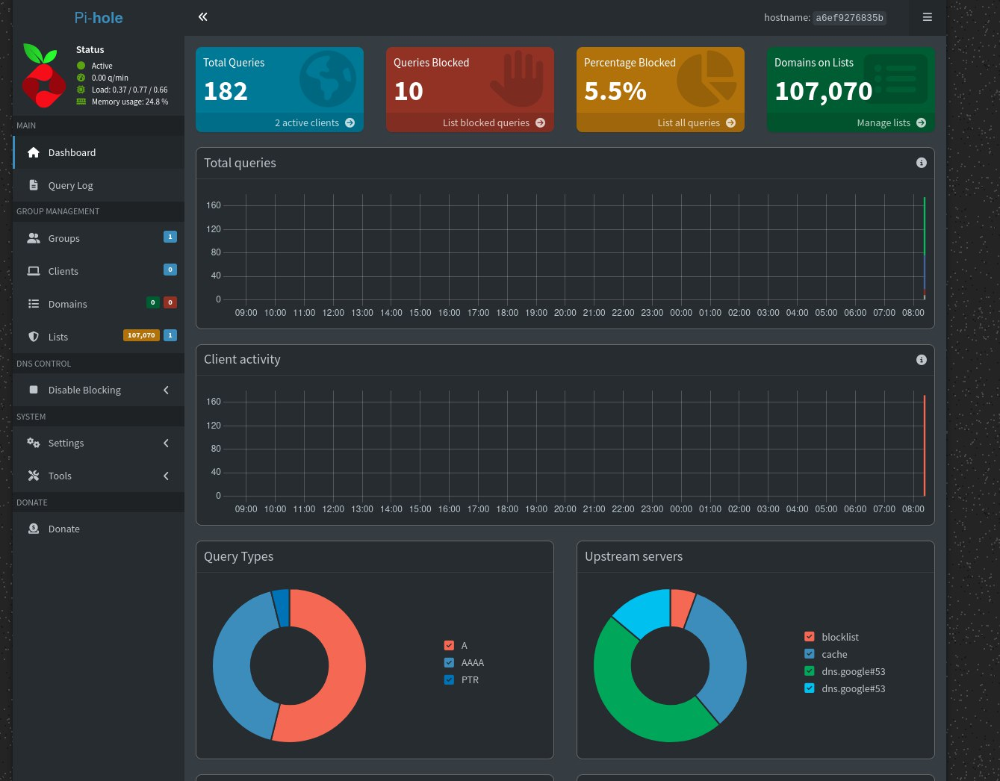
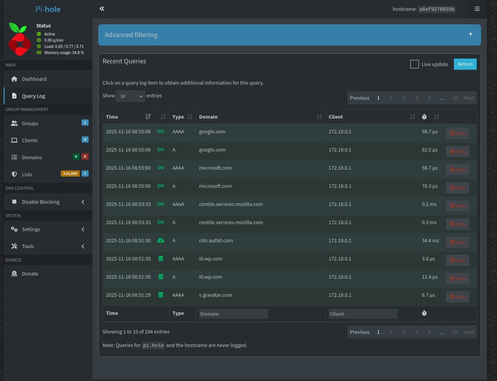
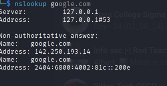

# Pi-hole Docker Deployment Guide

This repository documents the complete setup of **Pi-hole running in a Docker container** with **network-wide DNS filtering**, DNS verification, and router-level configuration.

---

## 📌 Overview

Pi-hole is a network-wide DNS sinkhole that blocks ads, trackers, and malicious domains before they reach your device. This guide walks through:

* Deploying Pi-hole using Docker Compose
* Configuring Kali Linux to use Pi-hole as its DNS resolver
* Updating router DNS settings for network-wide enforcement
* Validating DNS routing
* Screenshots (placeholders included)

---

## 📁 Project Structure

```
├── docker-compose.yml
└── README.md
```

---

## 🐳 Docker Deployment

Below is the `docker-compose.yml` used to deploy Pi-hole. Replace environment variables as needed.

```yaml
# More info at https://github.com/pi-hole/docker-pi-hole/ and https://docs.pi-hole.net/
services:
  pihole:
    container_name: pihole
    image: pihole/pihole:latest
    ports:
      # DNS Ports
      - "53:53/tcp"
      - "53:53/udp"
      # Default HTTP Port
      - "80:80/tcp"
      # Default HTTPs Port. FTL will generate a self-signed certificate
      - "443:443/tcp"
      # Uncomment the line below if you are using Pi-hole as your DHCP server
      #- "67:67/udp"
      # Uncomment the line below if you are using Pi-hole as your NTP server
      #- "123:123/udp"
    environment:
      TZ: 'India/Kolkata'
      FTLCONF_webserver_api_password: 'your_password'
      FTLCONF_dns_listeningMode: 'all'
    volumes:
      - './etc-pihole:/etc/pihole'
      #- './etc-dnsmasq.d:/etc/dnsmasq.d'
    cap_add:
      - NET_ADMIN
      - SYS_TIME
      - SYS_NICE
    restart: unless-stopped
```

---

## 🚀 Setup Instructions

### 1. Clone the Repository

```bash
git clone https://github.com/d1-d3m0n/Pi-Hole-Setup/
cd Pi-Hole-Setup
```

### 2. Start Pi-hole Container

```bash
sudo docker compose up -d
```

### 3. Confirm Pi-hole is Running

```bash
sudo docker ps
```

You should see the Pi-hole container listed.

---

## 🖥 Configure Kali Linux DNS

Update your DNS settings to route all DNS queries through Pi-hole.

### Check active network connections

```bash
nmcli connection show
```

### Set DNS server manually

```bash
sudo nmcli connection modify "Wired connection 1" ipv4.dns "<PIHOLE_IP>"
sudo nmcli connection modify "Wired connection 1" ipv4.ignore-auto-dns yes
sudo nmcli connection down "Wired connection 1" && sudo nmcli connection up "Wired connection 1"
```

Replace `<PIHOLE_IP>` with your Pi-hole server IP.

---

## 🌐 Configure Router DNS (Network-Wide Blocking)

Log into your router admin panel and set:

* **Primary DNS:** Pi-hole IP
* **Secondary DNS:** (Optional) None or a fallback resolver

This ensures all devices connected to your network use Pi-hole automatically.

---

## 🔍 DNS Verification Commands

Verify that DNS queries are routed through Pi-hole.

### Test using nslookup

```bash
nslookup google.com
```

You should see Pi-hole's IP as the DNS server.

### Test using dig

```bash
dig google.com
```

Look for the `SERVER:` line — it should show your Pi-hole IP.

---

## 📸 Screenshots

(Add your screenshots below)

### Pi-hole Dashboard



### Query Logs



### DNS Test Output



---

## 🛡 Advantages of Pi-hole in Cybersecurity

* Centralized DNS sinkholing
* Reduced attack surface (blocks malicious domains)
* Enhanced network visibility
* Containerized, reproducible deployment
* Improved bandwidth and performance

---

## 📘 Complete Documentation

This README covers the technical steps for deployment and verification.

If you have suggestions, improvements, or contributions—feel free to open an issue or PR.

---

## 📄 License

MIT License
